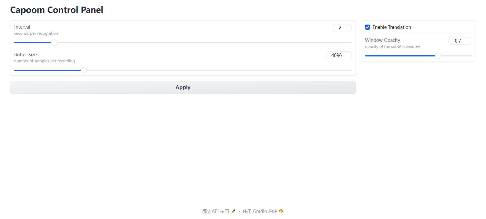

# Capoom

**Capoom** 是一个实时字幕生成器，可以读取当前设备播放的音频并实时展示中英双语字幕，为您观看视频、收听播客等带来便利，同时也可助力语言学习。


语音识别功能基于 OpenAI 的 [Whisper](https://github.com/openai/whisper) 模型实现，可以完成高质量的语音转文字任务，同时可以实现多语言向英语的翻译。英译中翻译功能使用了 [Helsinki-NLP](https://huggingface.co/Helsinki-NLP/opus-mt-en-zh) 的英译中模型。音频的录制使用了 `soundcard` 库。


## System Requirements

Windows 10/11 系统，至少 4GB 显存的 Nvidia 独立显卡。

（推荐）安装 [Anaconda](https://www.anaconda.com/download) 和 [FFmpeg](https://ffmpeg.org/)，并配置环境变量。


## Setup

首先应确保安装了 [CUDA Toolkit](https://developer.nvidia.com/cuda-toolkit) 及相应的 Nvidia 显卡驱动。

（可选）安装 [GoNotoKurrent](https://github.com/satbyy/go-noto-universal/releases) 字体用于字幕显示，未安装则使用微软雅黑字体。

克隆本仓库：

```shell
git clone https://github.com/Imiloin/Capoom.git
cd Capoom
```

创建一个新的 conda 环境并激活：

```shell
conda create -n capoom python=3.10
conda activate capoom
```

访问 [PyTorch 官网](https://pytorch.org/get-started/locally/) 获取适合系统和 CUDA 版本的 PyTorch 安装命令。一个示例命令如下：

```shell
# change the CUDA version to the one you have
conda install pytorch torchvision torchaudio pytorch-cuda=11.8 -c pytorch -c nvidia
# or use pip to install
pip3 install torch torchvision torchaudio --index-url https://download.pytorch.org/whl/cu118
```

安装 `Whisper` ：

```shell
pip install numba tqdm more-itertools tiktoken
pip install --upgrade --no-deps --force-reinstall git+https://github.com/openai/whisper.git
```

安装其他依赖：

```shell
pip install -r requirements.txt
```


## Usage

运行 `main.py` 即可。

```shell
python main.py --model medium
```
默认使用 `medium` 模型，如果显存不足，可以尝试使用 `small` 模型。`tiny` 模型的效果较差。

第一次运行可能需要下载模型，请耐心等待，或尝试更换网络环境。
模型的加载时间视电脑性能而定，可能需要半分钟左右。

如果运行成功，应当会在屏幕上显示一个半透明的黑色窗口，用于显示字幕。

在浏览器中打开 http://127.0.0.1:7860/ ，可以看到一个简单的控制面板，用于调整部分参数和控制翻译的开关。


`Interval` 参数决定了每次识别的时间间隔，单位是秒，默认值为 2。较大的数值可以取得更好的识别效果，但会增加延迟。

`Buffer Size` 参数决定了每次录制的音频数据的样本数量，默认值为 4096。较大的数值可以录制更长的音频提高完整性，但会增加少量延迟和内存占用。

`Enable Translation` 开关用于控制是否开启翻译功能，默认开启。在开启状态下，无论当前语音的使用的是什么语言，都会尝试将其翻译为中英双语。在关闭状态下，字幕显示会变为一栏，直接按当前语言显示识别的文本。

`opacity` 为字幕窗口的不透明度，取值范围为 0~1，默认值为 0.7。可以适当调整以适应不同的背景。


## References

[1] https://github.com/TadaoYamaoka/LoopbackWhisper

[2] https://github.com/openai/whisper

[3] https://huggingface.co/Helsinki-NLP/opus-mt-en-zh

[4] https://github.com/gradio-app/gradio/issues/3271#issuecomment-1440455811
